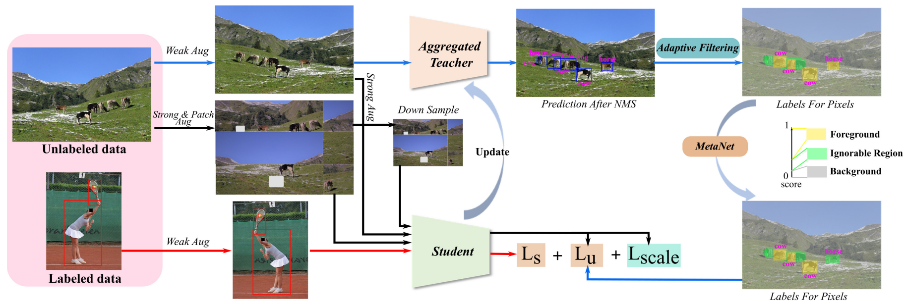

# [CVPR2022] DSL: [Dense Learning based Semi-Supervised Object Detection](https://arxiv.org/pdf/2204.07300.pdf)

DSL is the first work on Anchor-Free detector for Semi-Supervised Object Detection (SSOD).



__This code is established on [mmdetection](https://github.com/open-mmlab/mmdetection) and is only used for research.__


# Instruction

## Install dependencies

```bash
pytorch>=1.8.0
cuda 10.2
python>=3.8
mmcv-full 1.3.10
```

## GPU requirements

We train our model on 8 V100 GPUs.

## Download ImageNet pre-trained models for initializing DSL.

Download [resnet50_rla_2283.pth](https://drive.google.com/file/d/1cetP1SdOiwznLxlBUaHG8Q8c4RIwToWW/view) (Google) [resnet50_rla_2283.pth](https://pan.baidu.com/s/1GrNxNariVpb9S5EUFW1eng) (Baidu, extract code: 5lf1) for later DSL training.

# Training
For dynamically labeling the unlabeled images, original COCO dataset and VOC dataset will be converted to (`DSL-style`) datasets where annotations are saved in different json files and each image has its own annotation file. In addition, this implementation is slightly different from the original paper, where we clean the code, merge some data flow for speeding up training, add PatchShuffle also to the labeled images, and remove MetaNet for speeding up training as well, the final performance is similar as the original paper.

## Clone this project & Create data root dir
```bash
cd ${project_root_dir}
git clone https://github.com/chenbinghui1/DSL.git
mkdir data
mkdir ori_data

#resulting format
#${project_root_dir}
#      - ori_data
#      - data
#      - DSL
#        - configs
#        - ...
```

## For COCO Partially Labeled Data protocol
### 1. Download coco dataset and unzip it
```bash
mkdir ori_data/coco
cd ori_data/coco

wget http://images.cocodataset.org/annotations/annotations_trainval2017.zip
wget http://images.cocodataset.org/zips/train2017.zip
wget http://images.cocodataset.org/zips/val2017.zip
wget http://images.cocodataset.org/zips/unlabeled2017.zip

unzip annotations_trainval2017.zip -d .
unzip -q train2017.zip -d .
unzip -q val2017.zip -d .
unzip -q unlabeled2017.zip -d .

# resulting format
# ori_data/coco
#   - train2017
#     - xxx.jpg
#   - val2017
#     - xxx.jpg
#   - unlabled2017
#     - xxx.jpg
#   - annotations
#     - xxx.json
#     - ...
```

### 2. Convert coco to semicoco dataset
Use (`tools/coco_convert2_semicoco_json.py`) to generate the DSL-style coco data dir, i.e., semicoco/, which matches the code of unlabel training and pseudo-label update. 

```bash
cd ${project_root_dir}/DSL
python3 tools/coco_convert2_semicoco_json.py --input ${project_root_dir}/ori_data/coco --output ${project_root_dir}/data/semicoco
```

You will obtain ${project_root_dir}/data/semicoco/ dir

### 3. Prepare partially labeled data
Use (`data_list/coco_semi/prepare_dta.py`) to generate the partially labeled data list_file. Now we take 10% labeled data as example

```bash
cd data_list/coco_semi/
python3 prepare_dta.py --percent 10 --root ${project_root_dir}/ori_data/coco --seed 2
```

You will obtain (`data_list/coco_semi/semi_supervised/instances_train2017.${seed}@${percent}.json`)
                (`data_list/coco_semi/semi_supervised/instances_train2017.${seed}@${percent}-unlabel.json`)
                (`data_list/coco_semi/semi_supervised/instances_train2017.json`)
                (`data_list/coco_semi/semi_supervised/instances_val2017.json`)

These above files are only used as image_list.

### 4. Train supervised baseline model
Train base model via (`demo/model_train/baseline_coco.sh`); configs are in dir (`configs/fcos_semi/`); Before running this script please change the corresponding file path in both script and config files.
```bash
cd ${project_root_dir}/DSL
./demo/model_train/baseline_coco.sh
```

### 5. Generate initial pseudo-labels for unlabeled images(1/2)
Generate the initial pseudo-labels for unlabeled images via (`tools/inference_unlabeled_coco_data.sh`): please change the corresponding list file path of unlabeled data in the config file, and the model path in tools/inference_unlabeled_coco_data.sh.
```bash
./tools/inference_unlabeled_coco_data.sh
```

Then you will obtain (`workdir_coco/xx/epoch_xxx.pth-unlabeled.bbox.json`) which contains the pseudo-labels.

### 6. Generate initial pseudo-labels for unlabeled images(2/2)
Use (`tools/generate_unlabel_annos_coco.py`) to convert the produced (`epoch_xxx.pth-unlabeled.bbox.json`) above to DSL-style annotations
```bash
python3 tools/generate_unlabel_annos_coco.py \ 
          --input_path workdir_coco/xx/epoch_xxx.pth-unlabeled.bbox.json \
          --input_list data_list/coco_semi/semi_supervised/instances_train2017.${seed}@${percent}-unlabeled.json \
          --cat_info ${project_root_dir}/data/semicoco/mmdet_category_info.json \
          --thres 0.1
```

You will obtain (`workdir_coco/xx/epoch_xxx.pth-unlabeled.bbox.json_thres0.1_annos/`) dir which contains the DSL-style annotations.

### 7. DSL Training
Use (`demo/model_train/unlabel_train.sh`) to train our semi-supervised algorithm. Before training, please change the corresponding paths in config file and shell script.
```bash
./demo/model_train/unlabel_train.sh
```

## For COCO Fully Labeled Data protocol
The overall steps are similar as steps in above Partially Labeled Data guaidline. The additional steps to do is to download and organize the new unlabeled data.
### 1. Organize the new images
Put all the jpg images into the generated DSL-style semicoco data dir like: semicoco/unlabel_images/full/xx.jpg;
```bash
cd ${project_root_dir}
cp ori_data/coco/unlabled2017/* data/semicoco/unlabel_images/full/
```

### 2. Download the corresponding files
Download (`STAC_JSON.tar.gz`) and unzip it; move (`coco/annotations/instances_unlabeled2017.json`) to (`data_list/coco_semi/semi_supervised/`) dir
```bash
cd ${project_root_dir}/ori_data
wget https://storage.cloud.google.com/gresearch/ssl_detection/STAC_JSON.tar
tar -xf STAC_JSON.tar.gz

# resulting files
# coco/annotations/instances_unlabeled2017.json
# coco/annotations/semi_supervised/instances_unlabeledtrainval20class.json
# voc/VOCdevkit/VOC2007/instances_diff_test.json
# voc/VOCdevkit/VOC2007/instances_diff_trainval.json
# voc/VOCdevkit/VOC2007/instances_test.json
# voc/VOCdevkit/VOC2007/instances_trainval.json
# voc/VOCdevkit/VOC2012/instances_diff_trainval.json
# voc/VOCdevkit/VOC2012/instances_trainval.json

cp coco/annotations/instances_unlabeled2017.json ${project_root_dir}/DSL/data_list/coco_semi/semi_supervised/
```

### 3. Train as steps4-steps7 which are used in Partially Labeled data protocol
Change the corresponding paths before training.


## For VOC dataset
### 1. Download VOC data
Download VOC dataset to dir xx and unzip it, we will get (`VOCdevkit/`)
```bash
cd ${project_root_dir}/ori_data
wget http://host.robots.ox.ac.uk/pascal/VOC/voc2007/VOCtrainval_06-Nov-2007.tar
wget http://host.robots.ox.ac.uk/pascal/VOC/voc2007/VOCtest_06-Nov-2007.tar
wget http://host.robots.ox.ac.uk/pascal/VOC/voc2012/VOCtrainval_11-May-2012.tar
tar -xf VOCtrainval_06-Nov-2007.tar
tar -xf VOCtest_06-Nov-2007.tar
tar -xf VOCtrainval_11-May-2012.tar

# resulting format
# ori_data/
#   - VOCdevkit
#     - VOC2007
#       - Annotations
#       - JPEGImages
#       - ...
#     - VOC2012
#       - Annotations
#       - JPEGImages
#       - ...
```

### 2. Convert voc to semivoc dataset
Use (`tools/voc_convert2_semivoc_json.py`) to generate DSL-style voc data dir, i.e., semivoc/, which matches the code of unlabel training and pseudo-label update. 
```bash
cd ${project_root_dir}/DSL
python3 tools/voc_convert2_semivoc_json.py --input ${project_root_dir}/ori_data/VOCdevkit --output ${project_root_dir}/data/semivoc
```

And then use (`tools/dataset_converters/pascal_voc.py`) to convert the original voc list file to coco style file for evaluating VOC performances under COCO 'bbox' metric.
```bash
python3 tools/dataset_converters/pascal_voc.py ${project_root_dir}/ori_data/VOCdevkit -o data_list/voc_semi/ --out-format coco
```

You will obtain the list files in COCO-Style in dir: data_list/voc_semi/. These files are only used as val files, please refer to (`configs/fcos_semi/voc/xx.py`)

### 3. Combine with coco20class images
Copy (`instances_unlabeledtrainval20class.json`) to (`data_list/voc_semi/`) dir; and then run script (`data_list/voc_semi/combine_coco20class_voc12.py`) to produce the additional unlabel set with coco20classes.
```bash
cp ${project_root_dir}/ori_data/coco/annotations/semi_supervised/instances_unlabeledtrainval20class.json data_list/voc_semi/
cd data_list/voc_semi
python3 data_list/voc_semi/combine_coco20class_voc12.py \
                --cocojson instances_unlabeledtrainval20class.json \
                --vocjson voc12_trainval.json \
                --cocoimage_path ${project_root_dir}/data/semicoco/images/full \
                --outtxt_path ${project_root_dir}/data/semivoc/unlabel_prepared_annos/Industry/ \
                --outimage_path ${project_root_dir}/data/semivoc/unlabel_images/full
cd ../..
```

You will obtain the corresponding list file(.json): (`voc12_trainval_coco20class.json`), and the corresponding coco20classes images will be copyed to (`${project_root_dir}/data/semivoc/unlabeled_images/full/`) and the list file(.txt) will also be generated at (`${project_root_dir}/data/semivoc/unlabel_prepared_annos/Industry/voc12_trainval_coco20class.txt`)

### 4. Train as steps4-steps7 which are used in Partially Labeled data protocol
Please change the corresponding paths before training, and refer to configs/fcos_semi/voc/xx.py.

# Testing
Please refer to (`tools/semi_dist_test.sh`).
```bash
./tools/semi_dist_test.sh
```
 
We also provide the models trained by us bellow.

### COCO:
|Model|mAP|BaiduDrive|Extract Code|
|:---:|:----:|:----:|:--:|
|1% Data|22.1|[coco0.01](https://pan.baidu.com/s/18EEWimZjsup20VvBQ1J5Cw)|8p3i|
|2% Data|25.5|[coco0.02](https://pan.baidu.com/s/1JIb4U3qQlhnNw9n9qEVctQ)|bmf9|
|5% Data|31.5|[coco0.05](https://pan.baidu.com/s/1CbuaOk-JL9ApwggZ_mzZYw)|4b7j|
|10% Data|36.2|[coco0.1](https://pan.baidu.com/s/17t9HWQw8wPVxbMXHp-Ji8A)|t58q|
|All Data|43.8|[cocoAlldata](https://pan.baidu.com/s/1BWXY3h_F4N-zEZ5_bcAJYQ)|k4g9|

### VOC:
|Model|AP50|mAP|BaiduDrive|Extract Code|
|:---:|:----:|:---:|:----:|:--:|
|Unlabel: VOC12|80.7|56.8|[VOC12](https://pan.baidu.com/s/1utzAmco3WNir6EyFyrQIMA)|nu7b|
|Unlabel: VOC12+COCO20Classes|82.1|59.8|[VOC12-COCO20Classes](https://pan.baidu.com/s/1Xf67mxKwHudUYoNVOTvAmg)|79xp|


# Acknowledgement

-   [STAC](https://github.com/google-research/ssl_detection)
-   [RLA_Resnet](https://github.com/fangyanwen1106/RLANet)
